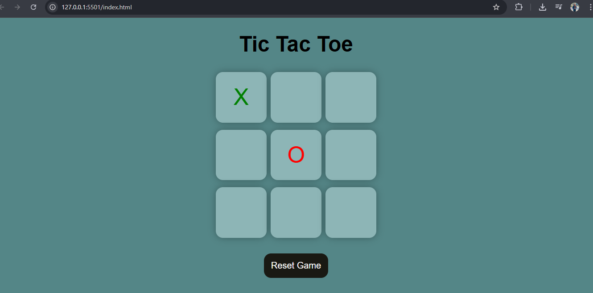

# Tic-Tac-Toe Game
A beginner-friendly Tic Tac Toe project to practice DOM manipulation, game logic, and responsive web design using HTML, CSS, and JavaScript.

## 📸 Screenshot

## ✅ Features

- 🎮 **Player vs Player Mode**: Enjoy a classic game of Tic Tac Toe with a friend.
- 🧼 **Simple, Clean UI**: Focus on the game with a clutter-free, intuitive interface.
- 📱 **Responsive Design**: Works seamlessly on desktop, tablet, and mobile devices.
- 🛠️ **No Frameworks**: Built using pure HTML, CSS, and JavaScript.
- 🔄 **Easy Reset**: Instantly clear the board and start a new match with the reset button.

## ✅ Technologies Used

- HTML
- CSS
- JavaScript

## 🚀 Live Demo

[Click here to play the game](https://tannuu29.github.io/tic-tac-toe-js/)
